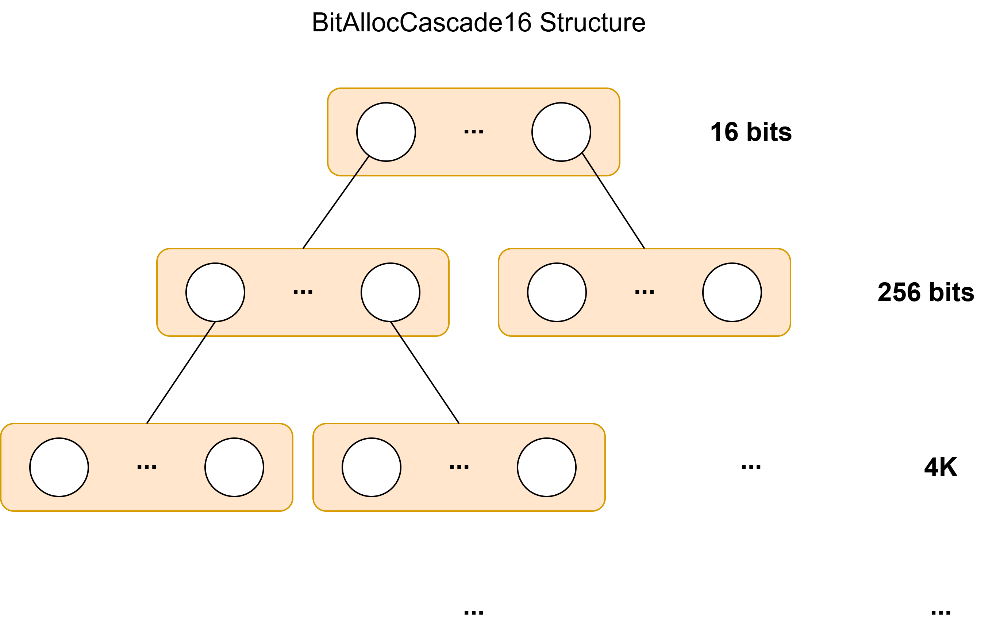

# Formal Verification of Memory Allocator in Hvisor

Proof Target: [bitmap-allocator](https://github.com/rcore-os/bitmap-allocator), which is a Bitmap-based allocator employs a multi-level bitmap structure to achieve efficient management of large-scale memory space.

## Introduction

### Why Memory Allocation Matters

In a Type-I Hypervisor, the memory allocator is responsible for assigning non-overlapping physical page ranges to different VMs. It collaborates with the page table to achieve strong isolation and verifiable security:

- **Disjointness**: At any time, allocated intervals must be non-overlapping.
- **Availability**: If there exists a sufficiently large contiguous free region, the allocator must be able to locate and return it.
- **Reclaimability**: Once released, an interval must return to the free set.
- **Hierarchy Consistency**: The parent-level bitmap must correspond exactly to the views of its child allocators.

The page table enforces **access control**, while the allocator ensures **non-overlapping intervals and resource scheduling**. Together, they form the foundation of memory isolation in virtual machines, as shown in the following figure.

### BitMap-Allocator Structure

The following figure illustrates the tree-like structure of bitmap-allocator. It's each layer manages an address space 16 times larger than the next layer below it.

### Proof Architecture

We divide the verification into three layers:

- The first layer includes several non-standard library functions that are invoked.
- The second layer is **BitAlloc16**, which serves as the leaf-node layer.
- The third layer is **BitAllocCascade16**, forming a complete 16-ary tree.
